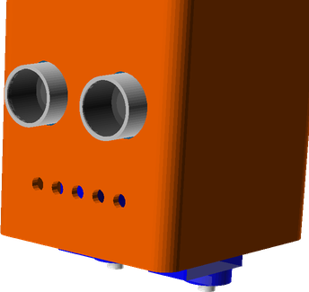
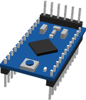
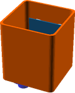
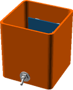

# BOBO
# Assembly Guide

## Bill of Materials

Make sure you have all of the following parts before you begin.

### Vitamins

Qty | Vitamin | Image
--- | --- | ---
1 | [Arduino Pro Mini Pins underneath, inc serial pins]() |  | 
4 | [AAA Battery]() |  | 
1 | [HCSR04 Ultrasonic Sensor]() |  | 
2 | [9g Micro Servo]() |  | 
1 | [SPST6A Mini Toggle Switch]() |  | 

### Printed Parts

Qty | Part Name | Image
--- | --- | ---
1 | [Head](../printedparts/stl/Head.stl) |  | 

**Plastic Required**

38.7cm3, 0.05KG,  approx: 0.63 GBP

# Assembly Instructions

## Final

### Vitamins

Qty | Vitamin | Image
--- | --- | ---
1 | [Arduino Pro Mini Pins underneath, inc serial pins]() |  | 
4 | [AAA Battery]() |  | 
1 | [HCSR04 Ultrasonic Sensor]() |  | 
2 | [9g Micro Servo]() |  | 
1 | [SPST6A Mini Toggle Switch]() |  | 

### Printed Parts

Qty | Part Name | Image
--- | --- | ---
1 | [Head](../printedparts/stl/Head.stl) |  | 

### Assembly Steps

1. Insert sensor

2. Left servo

3. Right servo

4. Power switch

5. Shove in an Arduino

6. Followed by a battery pack

