# SCOB
# Assembly Guide

## Bill of Materials

Make sure you have all of the following parts before you begin.

### Vitamins

Qty | Vitamin | Image
--- | --- | ---
1 | [Arduino Pro Mini Pins on top, inc serial pins]() | 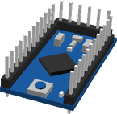 | 
4 | [AA Battery]() |  | 
1 | [Battery Pack]() | 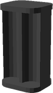 | 
1 | [HCSR04 Ultrasonic Sensor]() | 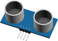 | 
4 | [9g Micro Servo]() | 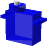 | 
1 | [SPST6A Mini Toggle Switch]() |  | 
4 | [Servo Horn]() | 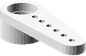 | 

### Printed Parts

Qty | Part Name | Image
--- | --- | ---
2 | [Foot](../printedparts/stl/Foot.stl) |  | 
1 | [Hat](../printedparts/stl/Hat.stl) |  | 
1 | [Head](../printedparts/stl/Head.stl) | 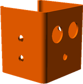 | 
1 | [Left Leg](../printedparts/stl/LeftLeg.stl) | 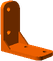 | 
1 | [Right Leg](../printedparts/stl/RightLeg.stl) |  | 

**Plastic Required**

73.7cm3, 0.09KG,  approx: 1.2 GBP

# Assembly Instructions

## Left Leg

### Vitamins

Qty | Vitamin | Image
--- | --- | ---
1 | [9g Micro Servo]() |  | 
1 | [Servo Horn]() |  | 

### Printed Parts

Qty | Part Name | Image
--- | --- | ---
1 | [Foot](../printedparts/stl/Foot.stl) |  | 

### Assembly Steps

1. Fix servo to foot
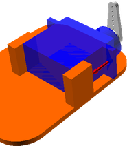

## Right Leg

### Vitamins

Qty | Vitamin | Image
--- | --- | ---
1 | [9g Micro Servo]() |  | 
1 | [Servo Horn]() |  | 

### Printed Parts

Qty | Part Name | Image
--- | --- | ---
1 | [Foot](../printedparts/stl/Foot.stl) |  | 

### Assembly Steps

1. Fix servo to foot

## Final

### Vitamins

Qty | Vitamin | Image
--- | --- | ---
1 | [Arduino Pro Mini Pins on top, inc serial pins]() |  | 
4 | [AA Battery]() |  | 
1 | [Battery Pack]() |  | 
1 | [HCSR04 Ultrasonic Sensor]() |  | 
2 | [9g Micro Servo]() |  | 
1 | [SPST6A Mini Toggle Switch]() |  | 
2 | [Servo Horn]() |  | 

### Printed Parts

Qty | Part Name | Image
--- | --- | ---
1 | [Hat](../printedparts/stl/Hat.stl) |  | 
1 | [Head](../printedparts/stl/Head.stl) |  | 
1 | [Left Leg](../printedparts/stl/LeftLeg.stl) |  | 
1 | [Right Leg](../printedparts/stl/RightLeg.stl) |  | 

### Sub-Assemblies

Qty | Name 
--- | --- 
1 | Left Leg
1 | Right Leg

### Assembly Steps

1. Insert sensor
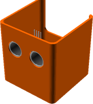
2. Left servo
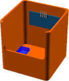
3. Right servo
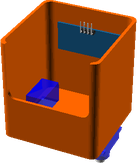
4. Power switch
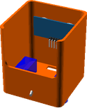
5. Shove in an Arduino
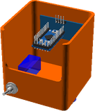
6. Followed by a battery pack
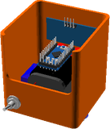
7. Attach the legs
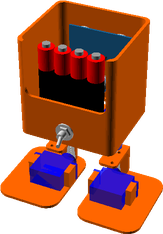
8. Add a hat
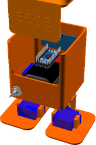

